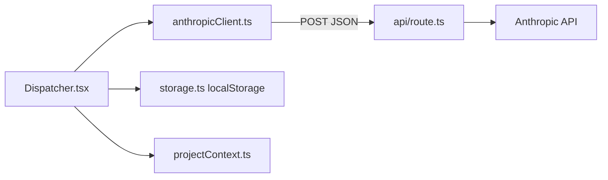

# Standalone Workforce dispatcher (from handoff)

## Context

- Local repo [`c:\Users\Alex\Desktop\workforce`](c:\Users\Alex\Desktop\workforce) matches the intended GitHub repo `abinghambyte/workforce` but currently has **no application files** (only `.git`).
- Source to port: [`skedaddle-portal/src/pages/TaskDispatcher.jsx`](c:\Users\Alex\Desktop\skedaddle-portal\src\pages\TaskDispatcher.jsx), routing logic from [`skedaddle-portal/functions/taskDispatcher.js`](c:\Users\Alex\Desktop\skedaddle-portal\functions\taskDispatcher.js), Tailwind v4 setup from [`skedaddle-portal/vite.config.js`](c:\Users\Alex\Desktop\skedaddle-portal\vite.config.js) + [`skedaddle-portal/src/index.css`](c:\Users\Alex\Desktop\skedaddle-portal\src\index.css) (dark `zinc` surfaces, `amber-500/600` accents, `rgb(9 9 11)` body background).
- **Copy verbatim** into `workforce/docs/`: `MODEL-REGISTRY.md`, `TEAM-BLUEPRINT.md`, `SESSION-HANDOFF-SCHEMA.md` from [`skedaddle-portal/docs/`](c:\Users\Alex\Desktop\skedaddle-portal\docs).

## Architecture (high level)

- **Client**: `projectContext` supplies `projectId` + roster/rules; `storage.ts` uses key `dispatcher:{projectId}:handoff` only via helpers.
- **Server**: Single POST handler validates body, builds **parameterized** system prompt (roster from `teamBlueprint`, invariants from `rules[]`), calls Anthropic with `claude-sonnet-4-6`, `max_tokens: 2000`, `temperature: 0.2`, `anthropic-version: 2023-06-01`, strips JSON fences (port `stripJsonFences`), returns parsed JSON or `{ error, raw }` with HTTP 200 on parse failure—matching current Firebase behavior.

## Phase 1 — `workforce` repo (this workspace)

### 1. Tooling and layout

- Initialize **Vite + React + TypeScript** (React 19 to align with portal [`package.json`](c:\Users\Alex\Desktop\skedaddle-portal\package.json)).
- Add **Tailwind CSS v4** via `@tailwindcss/vite` (same pattern as portal—prefer this over a separate PostCSS pipeline unless something in the stack requires `postcss.config.js`; the handoff’s `tailwind.config.js` can be omitted or kept minimal if a tool insists).
- Add ESLint (flat config, React Hooks + refresh) mirroring portal strictness enough for `npm run lint` to pass.
- Add [`vercel.json`](c:\Users\Alex\Desktop\workforce\vercel.json): `buildCommand` / `outputDirectory` for Vite (`dist`), SPA fallback rewrites **excluding** `/api/*`, and `functions["api/route.ts"].runtime = "nodejs22.x"`.
- [`.env.example`](c:\Users\Alex\Desktop\workforce\.env.example): `ANTHROPIC_API_KEY=` only.

### 2. `api/route.ts` (root)

- **POST only**; 405 otherwise.
- Validate: `task` non-empty; `sessionNotes` optional, trim and **slice(0, 12000)**; `projectContext` required with non-blank `projectId`; reject with clear JSON errors / status codes as appropriate.
- Read `process.env.ANTHROPIC_API_KEY`; if missing → 500 + `{ error: 'ANTHROPIC_API_KEY not configured' }`.
- Compose system prompt from [`ROUTING_SYSTEM_PROMPT`](c:\Users\Alex\Desktop\skedaddle-portal\functions\taskDispatcher.js) with these substitutions:
  - Generic dispatcher framing (not “Skedaddle-only” in the opening line if the product is multi-project—use neutral wording + `projectName` where it helps).
  - **WORKFORCE ROSTER** block built from `projectContext.teamBlueprint` (typed data → same style of bullet list as today).
  - **RULES** section: each string in `projectContext.rules` rendered **verbatim** (replacing the hardcoded “SKEDADDLE RULES” list).
  - Keep the **Antigravity** `## Goal` / `## Verification steps` / `## Success criteria` / `## What NOT to touch` instructions and the **JSON-only response** contract unchanged.
- `// TODO: when multi-user ships, gate on a Vercel-issued session token here.`

### 3. `src/lib` modules

- **[`storage.ts`](c:\Users\Alex\Desktop\workforce\src\lib\storage.ts)**: Implement exactly the API from the handoff (`Handoff`, `handoffKey`, `readHandoff`, `writeHandoff`, `clearHandoff`). No `localStorage` usage outside this file.
- **[`projectContext.ts`](c:\Users\Alex\Desktop\workforce\src\lib\projectContext.ts)**: Export `ProjectContext`, `WorkerEntry` (shape derived from [`TEAM-BLUEPRINT.md`](c:\Users\Alex\Desktop\skedaddle-portal\docs\TEAM-BLUEPRINT.md)), a constant map with seed project `projectId: 'skedaddle'`, and `loadProject(projectId)` returning the context (constant lookup for v1).
  - `stackSummary` and `rules` should mirror what the Firebase prompt currently encodes as Skedaddle invariants + stack line (so routing quality stays equivalent).
- **[`anthropicClient.ts`](c:\Users\Alex\Desktop\workforce\src\lib\anthropicClient.ts)**: `fetch('/api/route', { method: 'POST', headers: { 'Content-Type': 'application/json' }, body: JSON.stringify({ task, sessionNotes, modelHint, projectContext }) })`, typed response handling (including `error` + `raw`).

### 4. UI components and page

- **[`App.tsx`](c:\Users\Alex\Desktop\workforce\src\App.tsx) / [`main.tsx`](c:\Users\Alex\Desktop\workforce\src\main.tsx)**: Single routeless page mounting the dispatcher; wrap app root with dark background consistent with portal base styles.
- **[`Dispatcher.tsx`](c:\Users\Alex\Desktop\workforce\src\pages\Dispatcher.tsx)** (port of `TaskDispatcher.jsx`):
  - Remove Firebase (`httpsCallable`, `functions`, `useUserProfile`), remove `loading` / `allowed` gates.
  - Wire `runDispatch` through `anthropicClient` with **full `projectContext`** from active project.
  - Replace inline handoff read/write with `storage.ts` using **active `projectContext.projectId`**; update handoff help text to show `dispatcher:{projectId}:handoff` (use `handoffKey(projectId)` for display).
  - Add **`<ProjectSwitcher />`** above the 3-column grid: shows “Project: Skedaddle Portal”, dropdown UI disabled / single option (data-driven list for future projects).
  - Replace [`ModuleSubheader`](c:\Users\Alex\Desktop\skedaddle-portal\src\components\layout\ModuleSubheader.jsx) with a lightweight local header (same typography/classes; no `react-router` dependency in workforce v1).
- Split presentation per handoff (cleaner than one 300-line file):
  - [`DispatcherPanel.tsx`](c:\Users\Alex\Desktop\workforce\src\components\DispatcherPanel.tsx) — task column, result column, generated prompt column (existing markup/classes).
  - [`HandoffSection.tsx`](c:\Users\Alex\Desktop\workforce\src\components\HandoffSection.tsx) — four fields + clear (clear should call `storage.clearHandoff` + reset state).
  - [`ProjectSwitcher.tsx`](c:\Users\Alex\Desktop\workforce\src\components\ProjectSwitcher.tsx).

### 5. Docs and repo hygiene

- **New** [`docs/PROJECT-CONTEXT-SCHEMA.md`](c:\Users\Alex\Desktop\workforce\docs\PROJECT-CONTEXT-SCHEMA.md): document the five fields, `rules[]` convention (one invariant per element, injected verbatim), and the contract with `/api/route` and the project switcher.
- [`README.md`](c:\Users\Alex\Desktop\workforce\README.md): What / stack / local dev / deploy / how to add a project / how to extend team blueprint + links to registry docs.
- [`AGENTS.md`](c:\Users\Alex\Desktop\workforce\AGENTS.md): Prescriptive rules from handoff (keys, no client Anthropic, storage seam, no Firebase/auth v1).
- [`public/favicon.svg`](c:\Users\Alex\Desktop\workforce\public\favicon.svg): simple branded mark.

### 6. Local dev note (important)

- Plain `vite` will **not** serve `/api/route`. Document **`vercel dev`** (or equivalent) as the way to run API + frontend together locally, with `ANTHROPIC_API_KEY` in `.env.local` for Vercel’s env loader.

### 7. Verification (workforce)

- `npm run build` and `npm run lint` clean.
- Manual: submit a task that should route to Site Verifier; confirm `generatedPrompt` uses Antigravity section structure when assigned.

## Phase 2 — `skedaddle-portal` (separate folder; **after** production URL exists)

Per handoff: **separate commit**, only touch files allowed there.

1. Add [`src/constants/externalUrls.ts`](c:\Users\Alex\Desktop\skedaddle-portal\src\constants\externalUrls.ts) exporting `WORKFORCE_URL` (real Vercel URL).
2. [`Dashboard.jsx`](c:\Users\Alex\Desktop\skedaddle-portal\src\components\dashboard\Dashboard.jsx) (~307–310): Growth Lab secondary footer uses `{ href: WORKFORCE_URL, label: 'Launch Dispatcher', external: true }` instead of `{ to: '/dispatch', ... }`.
3. [`ProjectCard.jsx`](c:\Users\Alex\Desktop\skedaddle-portal\src\components\dashboard\ProjectCard.jsx): extend `secondaryFooter` to support `href` + `external`; render `<a href={...} target="_blank" rel="noopener noreferrer">` for external secondary CTA while keeping existing `to` + `Link` behavior for internal routes.
4. [`App.jsx`](c:\Users\Alex\Desktop\skedaddle-portal\src\App.jsx): replace `/dispatch` route with a tiny `DispatchRedirect` component using `useEffect` + `window.location.replace(WORKFORCE_URL)` (React Router `Navigate` cannot send users to an external origin).
5. Leave [`TaskDispatcher.jsx`](c:\Users\Alex\Desktop\skedaddle-portal\src\pages\TaskDispatcher.jsx) in tree temporarily; schedule removal after 2026-04-29 per handoff.

**Standing constraint from handoff**: do not modify other Firebase functions, Slack, Firestore rules, or auth beyond this route/CTA swap; do not run `npm run deploy:firebase` for this workstream.

## Risk / scope notes

- **Storage key change**: old portal key was `dispatcher:handoff`; new key is `dispatcher:skedaddle:handoff`. Existing saved handoffs will not auto-migrate (handoff already accounts for a two-week overlap and manual copy if needed).
- **`teamBlueprint` typing**: implement a concise `WorkerEntry` type and a formatter so the server prompt stays aligned with the markdown roster without duplicating prose in two conflicting places.
